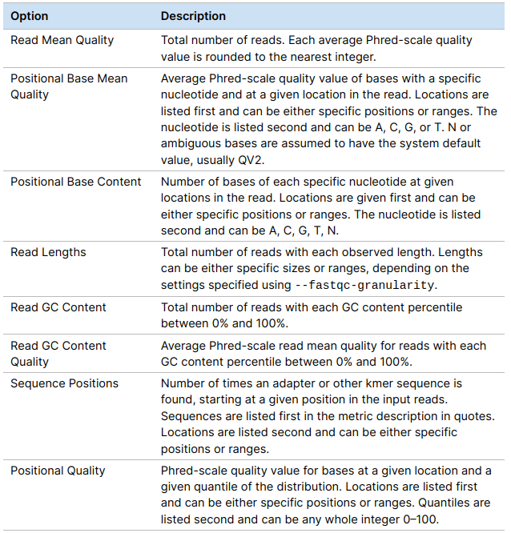

# EDA of `FastQ_metrics.csv` output

The metrics are generated automatically on all DRAGEN map-align workflows, with no additional run time, and output in a `CSV` format file called `<PREFIX>.fastqc_metrics.csv`. 

The reported metrics are organized into eight sections by metric type. Each section is categorized into separate rows by length, position, or other relevant categorical variables. The following metric types compose the sections. 



Here an example of [FastQ_metrics.csv](https://github.com/ewels/MultiQC/files/9564840/I33974-L3.fastqc_metrics.csv) Report,  available in this github [thread](https://github.com/ewels/MultiQC/issues/1737).

We will explore this file and try to visualize different Metrics.

```{r, message=FALSE}
# Load needed packages
library(tidyverse, warn.conflicts = FALSE)
library(gridExtra)
library(plotly)
```


```{r}
# Read csv file
fastq <- read_csv("I33974-L3.fastqc_metrics.csv", col_names = FALSE, show_col_types = FALSE) %>%
         rename(Section =X1, Mate=X2, Metric=X3, Value=X4)

```

* Some issue is in data structure.

```{r}
# check problems in the structure of csv
problems(fastq)
```
* Some rows have 5 columns

```{r}
# glimpse rows with 5 columns
fastq %>%
  slice(1694, 1819, 1834, 1972, 5341, 5457, 5476, 5615)
```

* Explore manually rows with 5 columns


* At this point we will ignore 5th columns

## Look for relationships between Sections

We will check which Metrics have the same number of samples.

```{r}
fastq %>%
  group_by(Section, Mate) %>%
  summarise(N = n(), .groups = "keep") %>%
      DT::datatable(options = list(scrollX = TRUE,
                 columnDefs = list(list(className = 'dt-center', targets = "_all"))
                ),
                rownames = FALSE
                )
```

* The `READ GC CONTENT` and `READ GC CONTENT QUALITY` seem to be related.  We will try to plot theme side-by-side.


### `READ MEAN QUALITY`

It is the Total number of reads. Each average Phred-scale quality value is rounded to the nearest integer.

```{r}
foo <- fastq %>%
  filter(Section %in% c( "READ MEAN QUALITY")) %>%
    mutate(across('Metric', str_replace, ' Reads', '')) %>%
  mutate(across('Metric', str_replace, 'Q', '')) %>%
  mutate(Metric = as.numeric(Metric)) 

foo %>%
  ggplot() +
  aes(x = Metric , y = Value, colour= Mate) +
   geom_line() +
  labs(title= "READ MEAN QUALITY")+
  theme(axis.text.x = element_text(colour = "#277a91", face="bold", angle = 45))+
  scale_x_continuous(breaks= seq(10, 35,5),
                     labels = c("Q10", "Q15", "Q20", "Q25", "Q30", "Q35"))

```

###  `POSITIONAL BASE MEAN QUALITY` versus `POSITIONAL BASE CONTENT`

```{r,fig.height=8, fig.width=12}
foo <-fastq %>%
  filter(Section %in% c("POSITIONAL BASE CONTENT","POSITIONAL BASE MEAN QUALITY"))  %>%
  mutate(across('Metric', str_replace, ' Average Quality', '')) %>%
  mutate(across('Metric', str_replace, ' Bases', '')) %>%
  mutate(across('Metric', str_replace, 'ReadPos ', '')) %>%
  tidyr::spread(key = Section, value = Value) %>%
  tidyr::separate(Metric, c("Positions", "Base"), sep=" ") %>%
  mutate(Positions = as.numeric(Positions)) 

p1 <- foo %>% #na.omit() %>%
  ggplot() +
  geom_point(aes(x = Positions , y = `POSITIONAL BASE CONTENT`, colour= Base)) +
  facet_wrap(~Mate, nrow = 2) +
  labs(title = "POSITIONAL BASE CONTENT")
# scale_x_discrete(guide = guide_axis(n.dodge = 2)) 

p1


```


```{r,fig.height=8, fig.width=12}


p2 <- foo %>% na.omit() %>%
  ggplot() +
  geom_point(aes(x = Positions , y = `POSITIONAL BASE MEAN QUALITY`, colour= Base)) +
  facet_wrap(~Mate, nrow = 2) +
  labs(title = "POSITIONAL BASE MEAN QUALITY")
  #scale_x_discrete(guide = guide_axis(angle = 90)) +
  #scale_x_discrete(guide = guide_axis(n.dodge = 2)) 

#grid.arrange(p1, p2, ncol = 2)
p2
```

### `READ GC CONTENT` versus `READ GC CONTENT QUALITY`

```{r, fig.height=4, fig.width=12}

foo <- fastq %>%
  filter(Section %in% c("READ GC CONTENT", "READ GC CONTENT QUALITY")) %>%
  mutate(across('Metric', str_replace, ' Average Quality', '')) %>%
  tidyr::spread(key = Section, value = Value) %>%
  mutate(across('Metric', str_replace, '% GC Reads', '')) %>%
  mutate(Metric = as.numeric(Metric)) %>%
  rename(Percentage = Metric)
 # mutate(`READ GC CONTENT` = log(`READ GC CONTENT`)) 


p1 <- ggplot(foo) +
    geom_line(aes(x = Percentage , y = `READ GC CONTENT QUALITY`, colour= Mate))

p2 <- ggplot(foo)+
      geom_line(aes(x = Percentage , y = `READ GC CONTENT`, colour= Mate))+
      theme(legend.position = "")


grid.arrange(p1, p2, ncol = 2)
  

```


### `SEQUENCE POSITIONS`

```{r,fig.height=8, fig.width=12}
foo <- fastq %>%
  filter(Section %in% c( "SEQUENCE POSITIONS")) %>%
  mutate(across('Metric', str_replace, ' Sequence', '')) %>%
  tidyr::separate(Metric, c("Reads","Starts", "NA"), sep = " " ) %>%
  select(-`NA`) %>%
  mutate(across('Starts', str_replace, 'bp', '')) %>%
  filter(Starts != "Total") %>% ## filtering these rows which are the some of each read.
  mutate(Starts = as.numeric(Starts)) #%>%
#filter(Reads != "'CTGTCTCTTATA'")
#group_by(Read,Mate) %>%
#summarise(Total = sum(Value), .groups = "keep")

p2 <- foo %>% 
  ggplot() +
  geom_point(aes(x = Starts , y = Value, colour= Reads)) +
  facet_wrap(~Mate, nrow = 2) +
  labs(title= "Sequence Positions")+
  theme(legend.position = c(0.1,0.84), 
        legend.background = element_rect(fill= "transparent"),
        legend.key = element_rect(colour = "transparent", fill= "transparent"))
#ggforce::facet_zoom(ylim = c(0, 25))

#plotly::ggplotly(p1)
p2
```


* Zoom In Sequence Positions

```{r,fig.height=8, fig.width=12}
p2 <- foo %>% na.omit() %>%
  ggplot() +
  geom_line(aes(x = Starts , y = Value, colour= Reads)) +
  coord_cartesian(ylim=c(0,30)) +
  facet_wrap(~Mate, nrow = 2) +
  labs(title= "Zoom In Sequence Positions")+
  theme(legend.position = c(0.9,0.92), 
        legend.background = element_rect(fill= "transparent"),
        legend.key = element_rect(colour = "transparent", fill= "transparent"))

p2
```


### `POSITIONAL QUALITY`

```{r,fig.height=8, fig.width=12}
foo <- fastq %>%
  filter(Section %in% c( "POSITIONAL QUALITY")) %>%
  mutate(across('Metric', str_replace, '% Quantile QV', '')) %>%
  mutate(across('Metric', str_replace, 'ReadPos ', '')) %>%
  tidyr::separate(Metric, c("Positions", "Quantile"), sep=" ") %>%
  mutate(Positions = as.numeric(Positions),
         Quantile = as.numeric(Quantile)/100 )

foo %>%
  ggplot() +
  aes(x = Positions, y= Value , colour= Quantile) +
  geom_jitter() +
  facet_wrap(~Mate, nrow = 2) +
  labs(title= "POSITIONAL QUALITY")
  
```
