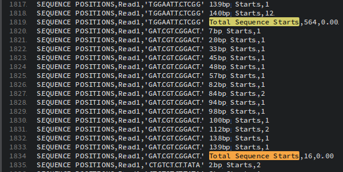

```{r setup, include=FALSE, echo=FALSE}
knitr::opts_chunk$set(echo=TRUE, error=FALSE)
```

{style="display: block; margin: 0 auto"}

# EDA of `FastQ_metrics.csv` output

The metrics are generated automatically on all DRAGEN map-align workflows, with no additional run time, and output in a `CSV` format file called `<PREFIX>.fastqc_metrics.csv`. 

The reported metrics are organized into eight sections by metric type. Each section is categorized into separate rows by length, position, or other relevant categorical variables. The following metric types compose the sections. 

{style="display: block; margin: 0 auto"}

Here an example of [FastQ_metrics.csv](https://github.com/ewels/MultiQC/files/9564840/I33974-L3.fastqc_metrics.csv) Report,  available in this github [thread](https://github.com/ewels/MultiQC/issues/1737).

We will explore this file and try to visualize different Metrics.

```{r, message=FALSE}
# Load needed packages
library(tidyverse, warn.conflicts = FALSE)
library(gridExtra)
library(plotly)
```


```{r}
# Read csv file
fastqc <- read_csv("I33974-L3.fastqc_metrics.csv", col_names = FALSE, show_col_types = FALSE) %>%
  rename(Section =X1, Mate=X2, Metric=X3, Value=X4)

```

* Some issue is in data structure.

```{r}
# check problems in the structure of csv
problems(fastqc)
```
* Some rows have 5 columns

```{r}
# glimpse rows with 5 columns
fastqc %>%
  slice(1694, 1819, 1834, 1972, 5341, 5457, 5476, 5615)
```

* Explore manually rows with 5 columns

{style="display: block; margin: 0 auto" }

* At this point we will ignore 5th column

## Look for relationships between Sections

We will check which Metrics have the same number of samples.

```{r}
fastqc %>%
  group_by(Section, Mate) %>%
  summarise(N = n(), .groups = "keep") %>%
  DT::datatable(options = list(scrollX = TRUE,
                               columnDefs = list(list(className = 'dt-center', targets = "_all"))
  ),
  rownames = FALSE
  )
```

* The `READ GC CONTENT` and `READ GC CONTENT QUALITY` seem to be related.  We will try to plot theme side-by-side.

### `READ LENGTH`

Total number of reads with each observed length. Lengths can be either specific sizes or ranges, depending on the settings specified using `--fastqc-granularity`.

```{r}
fastqc %>%
  filter(Section== "READ LENGTHS") %>%
  DT::datatable(options = list(scrollX = TRUE,
                               columnDefs = list(list(className = 'dt-center', targets = "_all"))
  ),
  rownames = FALSE
  )
```


### `READ MEAN QUALITY`

It is the Total number of reads. Each average Phred-scale quality value is rounded to the nearest integer.

```{r}
foo <- fastqc %>%
  filter(Section %in% c( "READ MEAN QUALITY")) %>%
  mutate( Metric = str_replace(Metric, ' Reads', '')) %>%
  mutate( Metric = str_replace(Metric, 'Q', '')) %>%
  mutate(Metric = as.numeric(Metric)) 

foo %>%
  ggplot() +
  aes(x = Metric , y = Value, colour= Mate) +
  geom_line() +
  labs(title= "READ MEAN QUALITY")+
  theme(axis.text.x = element_text(colour = "#277a91", face="bold", angle = 45))+
  scale_x_continuous(breaks= seq(10, 40,5),
                     labels = c("Q10", "Q15", "Q20", "Q25", "Q30", "Q35", "Q40"))+
  xlab("Mean Sequence Quality")+
  ylab("Count")

```

###  `POSITIONAL BASE MEAN QUALITY` versus `POSITIONAL BASE CONTENT`

* Average Phred-scale quality value of bases with a specific nucleotide and at a given location in the read. Locations are listed first and can be either specific positions or ranges. The nucleotide is listed second and can be A, C, G, or T. N or ambiguous bases are assumed to have the system default value, usually QV2.

* Number of bases of each specific nucleotide at given locations in the read. Locations are given first and can be either specific positions or ranges. The nucleotide is listed second and can be A, C, G, T, N.


```{r,fig.height=8, fig.width=10}
foo <-fastqc %>%
  filter(Section %in% c("POSITIONAL BASE CONTENT","POSITIONAL BASE MEAN QUALITY"))  %>%
  mutate(Metric = str_replace(Metric, ' Average Quality', '')) %>%
  mutate(Metric = str_replace(Metric, ' Bases', '')) %>%
  mutate(Metric = str_replace(Metric,'ReadPos ', '')) %>%
  # mutate(across('Metric', str_replace, ' Average Quality', '')) %>%
  #mutate(across('Metric', str_replace, ' Bases', '')) %>%
  #mutate(across('Metric', str_replace, 'ReadPos ', '')) %>%
  tidyr::spread(key = Section, value = Value) %>%
  tidyr::separate(Metric, c("Positions", "Base"), sep=" ") %>%
  mutate(Positions = as.numeric(Positions)) 

p1 <- foo %>% #na.omit() %>%
  ggplot() +
  geom_line(aes(x = Positions , y = `POSITIONAL BASE CONTENT`, colour= Base)) +
  facet_wrap(~Mate, nrow = 2) +
  labs(title = "POSITIONAL BASE CONTENT")
# scale_x_discrete(guide = guide_axis(n.dodge = 2)) 

ggplotly(p1)
```


```{r,fig.height=8, fig.width=10}
p2 <- foo %>% na.omit() %>%
  ggplot() +
  geom_line(aes(x = Positions , y = `POSITIONAL BASE MEAN QUALITY`, colour= Base)) +
  facet_wrap(~Mate, nrow = 2) +
  labs(title = "POSITIONAL BASE MEAN QUALITY")
#scale_x_discrete(guide = guide_axis(angle = 90)) +
#scale_x_discrete(guide = guide_axis(n.dodge = 2)) 

#grid.arrange(p1, p2, ncol = 2)
#plotly::ggplotly(p2)
ggplotly(p2)
```

* Scatter3d

```{r,fig.height=8, fig.width=10, warning=FALSE}
foo <- fastqc %>% na.omit() %>%
  filter(Section %in% c("POSITIONAL BASE CONTENT","POSITIONAL BASE MEAN QUALITY"))  %>%
  mutate(Metric = str_replace(Metric, ' Average Quality', '')) %>%
  mutate(Metric = str_replace(Metric, ' Bases', '')) %>%
  mutate(Metric = str_replace(Metric,'ReadPos ', '')) %>%
  #mutate(across('Metric', str_replace, ' Average Quality', '')) %>%
  #mutate(across('Metric', str_replace, ' Bases', '')) %>%
  #mutate(across('Metric', str_replace, 'ReadPos ', '')) %>%
  tidyr::spread(key = Section, value = Value) %>%
  tidyr::separate(Metric, c("Positions", "Base"), sep=" ") %>%
  mutate(Positions = as.numeric(Positions)) %>%
  rename(Content = `POSITIONAL BASE CONTENT`, Quality= `POSITIONAL BASE MEAN QUALITY`)#%>%
#mutate(across('Mate', str_replace, 'Read', '')) %>%
#mutate(Mate = as.numeric(Mate))


plotly::plot_ly(data= foo, type = "scatter3d", mode = 'markers',
                x= ~Positions, y= ~Quality, z= ~Content,
                color=~Base, 
                marker= list(size=3#, #color=~as.factor(Mate),
                             #line= list(color=~as.factor(Mate), width=1)
                )) #%>%
#add_trace( x= ~Positions, y= ~Quality, #z= ~Content, name = 'trace 1',
#            mode = 'lines', color=~Base~Mate) 
```


### `READ GC CONTENT` versus `READ GC CONTENT QUALITY`

* Total number of reads with each GC content percentile between $0%$ and 100%

* Average Phred-scale read mean quality for reads with each `GC` content percentile between $0%$ and $100%$. 

```{r, fig.height=4, fig.width=12}

foo <- fastqc %>%
  filter(Section %in% c("READ GC CONTENT", "READ GC CONTENT QUALITY")) %>%
  mutate(Metric = str_replace(Metric,  ' Average Quality', '')) %>%
  tidyr::spread(key = Section, value = Value) %>%
  mutate(Metric = str_replace(Metric, '% GC Reads', '')) %>%
  mutate(Metric = as.numeric(Metric)) %>%
  rename(`GC Count Percentile` = Metric)
# mutate(`READ GC CONTENT` = log(`READ GC CONTENT`)) 


p1 <- ggplot(foo) +
  geom_line(aes(x = `GC Count Percentile` , y = `READ GC CONTENT QUALITY`, colour= Mate))

p2 <- ggplot(foo)+
  geom_line(aes(x = `GC Count Percentile` , y = `READ GC CONTENT`, colour= Mate))+
  theme(legend.position = "")


grid.arrange(p1, p2, ncol = 2)
  

```


### `SEQUENCE POSITIONS`

It is the Number of times an adapter or other kmer sequence is found, starting at a given position in the input reads. Sequences are listed first in the metric description in quotes. Locations are listed second and can be either specific positions or ranges. 

```{r,fig.height=8, fig.width=9.5}
foo <- fastqc %>%
  filter(Section %in% c( "SEQUENCE POSITIONS")) %>%
  mutate(Metric = str_replace(Metric,  ' Sequence', '')) %>%
  tidyr::separate(Metric, c("Reads","Starts", "NA"), sep = " " ) %>%
  select(-`NA`) %>%
  mutate(Starts = str_replace(Starts, 'bp', '')) %>%
  filter(Starts != "Total") %>% ## filtering these rows which are the sum of reads.
  mutate(Starts = as.numeric(Starts)) #%>%
#filter(Reads != "'CTGTCTCTTATA'")
#group_by(Read,Mate) %>%
#summarise(Total = sum(Value), .groups = "keep")

p1 <- foo %>% 
  ggplot() +
  aes(x = Starts , y = Value, colour= Reads) +
  geom_point(size=1) +
  facet_wrap(~Mate, nrow = 2) +
  labs(title= "Sequence Positions")+
  theme(legend.position = c(0.1,0.84), 
        legend.background = element_rect(fill= "transparent"),
        legend.key = element_rect(colour = "transparent", fill= "transparent"),
        legend.text = element_text(colour="black", size=8, face="bold", family="Courier New")) +
  xlab("Postions X bp Starts") +
  ylab("Nbr. adapter or kmer founded")
#ggforce::facet_zoom(ylim = c(0, 25))

plotly::ggplotly(p1, dynamicTicks = TRUE) %>%
  #rangeslider() %>%
layout(autosize=TRUE, hovermode= 'compare',
       xaxis = list(autorange = TRUE),
       yaxis = list(autorange = TRUE),
       legend = list(orientation= "v", x = 0.1, y= 0.99))

#p1
```


* Zoom In Sequence Positions

```{r,fig.height=8, fig.width=12}
p2 <- foo %>% na.omit() %>%
  ggplot() +
  geom_line(aes(x = Starts , y = Value, colour= Reads)) +
  coord_cartesian(ylim=c(0,30)) +
  facet_wrap(~Mate, nrow = 2) +
  labs(title= "Zoom In Sequence Positions")+
  xlab("Postions X bp Starts") +
  ylab("Nbr. adapter or kmer founded")+
  theme(legend.position = c(0.9,0.92), 
        legend.background = element_rect(fill= "transparent"),
        legend.key = element_rect(colour = "transparent", fill= "transparent"))

#ggplotly(p2)
p2
```

### what about Seqeunces

```{r}
fastqc %>%
  filter(Section %in% c( "SEQUENCE POSITIONS")) %>%
  mutate(Metric = str_replace(Metric, ' Sequence', '')) %>%
  tidyr::separate(Metric, c("Reads","Starts", "NA"), sep = " " ) %>%
  select(-`NA`) %>%
  mutate(Starts = str_replace(Starts, 'bp', '')) %>%
  filter(Starts != "Total") %>% ## filtering these rows which are the sum of reads.
  mutate(Starts = as.numeric(Starts)) %>%
  distinct(Reads)


```


### `POSITIONAL QUALITY`

```{r, fig.height=8, fig.width=12,  warning=FALSE, message=FALSE}
foo <- fastqc %>%
  filter(Section %in% c( "POSITIONAL QUALITY")) %>%
  mutate(Metric = str_replace(Metric, '% Quantile QV', '')) %>%
  mutate(Metric= str_replace(Metric, 'ReadPos ', '')) %>%
  tidyr::separate(Metric, c("Positions", "Quantile"), sep=" ") %>%
  mutate(Positions = as.numeric(Positions),
         Quantile = as.numeric(Quantile)/100 )

p1 <- foo %>%
  ggplot() +
  aes(x = Positions, y= Value , colour= Quantile) +
  geom_jitter() +
  geom_smooth() +
  facet_wrap(~Mate, nrow = 2) +
  labs(title= "POSITIONAL QUALITY")+
  ylab("Phred-scale quality")
 
p1 
```

```{r, fig.height=8, fig.width=10, warning=FALSE, message=FALSE}
p1 <- foo %>%
  #mutate(Positions = as.factor(Positions))%>%
  group_by(Positions, Mate) %>%
  summarise(Quality = mean(Value), .groups = "keep") %>%
  ungroup() %>%
  mutate(Range= if_else(Quality <= 31, "0-31",
                        if_else(Quality>31 & Quality <= 33, "32-33", "> 33"))) %>%
  ggplot() +
  aes(x = Positions, y= Quality , colour= Range) +
  #geom_smooth(method = 'loess', formula = 'Quality~Positions') +
  geom_smooth(lwd=0.5)+
  geom_jitter(size=1) +
  #geom_line()+
  facet_wrap(~Mate, nrow = 2) +
  labs(title= "Quality by Position")+
  ylab("Phred-scale quality") +
  theme(axis.text.x = element_text(colour = "#277a91", 
                                   face="bold", angle = 0, hjust = 1),
                                   panel.background = element_rect(fill = "white", colour="grey"),
         panel.grid.major = element_line(colour = "grey", linetype = "dotted")
        )+
  #scale_x_discrete(guide = guide_axis(n.dodge = 2))+
   #scale_colour_gradientn(colors = c("red2", "orange", "green"),
  #                     limits = c(0, 40),
  #                     breaks = c(0, 32, 35, 40))+
  NULL 

ggplotly(p1)
```

