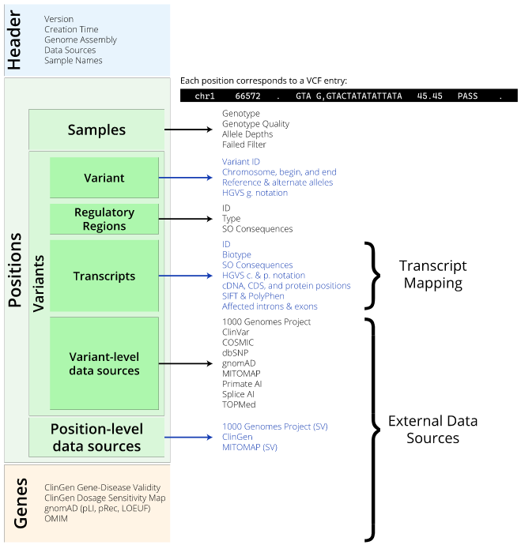
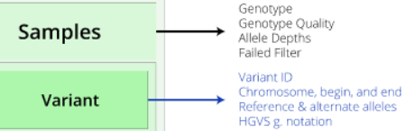
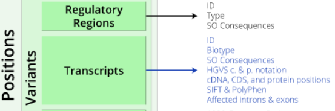
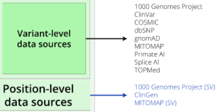

```{r setup, include=FALSE, echo=FALSE}
knitr::opts_chunk$set(echo=TRUE, error=FALSE)
```

{align="right"}
&nbsp;

&nbsp;

&nbsp;

&nbsp;

&nbsp;

&nbsp;

# JSON Structure

{align="center"}


#  R Environment

[Link](https://github.com/Illumina/NirvanaDocumentation/blob/master/static/files/parse-nirvana-json-r.ipynb) to Illumina parsing style.

```{bash, eval=FALSE}
# Load  an example of Nirvana json file output
wget https://illumina.github.io/NirvanaDocumentation/files/HiSeq.10000.json.gz
```

## Extact Header, Positions and Genes Objects from JSON.gz file

```{r ,  message=FALSE}
require(jsonlite)
require(DT)
require(tidyr)
require(dplyr)

file = gzfile('HiSeq.10000.json.gz', 'rt')
#file = gzfile('ceph_trio_test.json.gz', 'rt')

header = ''
positions = c()
genes = c()
is_header_line = TRUE
is_position_line = FALSE
is_gene_line = FALSE
gene_section_line = '],"genes":['
end_line = ']}'
position_count = 0
gene_count = 0
while ( TRUE ) {
    line = readLines(file, n = 1)
    trim_line = trimws(line)
    if ( is_header_line ) {
        ## only keep the "header" field content from the line
        header = substr(trim_line, 11, nchar(trim_line)-14)
        is_header_line = FALSE
        is_position_line = TRUE
        next
    }
    if ( trim_line == gene_section_line ) {
        is_gene_line = TRUE
        is_position_line = FALSE
        next
    }
    else if ( trim_line == end_line ) {
        break
    }
    else {
        if ( is_position_line ) {
            ## remove the trailing ',' if there is
            positions = c(positions, sub(",$", "", trim_line))
            position_count = position_count + 1
        }
        if ( is_gene_line ) {
            ## remove the trailing ',' if there is
            genes = c(genes, sub(",$", "", trim_line))
            gene_count = gene_count + 1
        }
    }
}
close(file)

paste0('Header Object_',1:5,": ", fromJSON(header)[1:5])
```

```{r}
#gsub('"', '', header, fixed=TRUE)
DT::datatable(fromJSON(header)[6][[1]], 
              options = list(scrollX = TRUE,
                             columnDefs = list(list(className = 'dt-center', targets = all))
                             ), 
              rownames = FALSE, caption = 'Header Object_6')
```

```{r}
print(paste('number of positions: ', position_count))
print(paste('number of genes: ', gene_count))
```

## Convert Positions object to a Dataframe

{width=30%}{width=30%}{width=30%}


```{r}

#fromJSON(positions[7]) %>% as.data.frame()  %>% DT::datatable(options = list(scrollX = TRUE), rownames = TRUE) 

#bind_rows(fromJSON(positions[7])) %>% 
#  tidyr::unnest(cols = c(samples, variants), names_sep = ".") %>% 
#  DT::datatable(options = list(scrollX = TRUE), rownames = TRUE) 

#fromJSON(positions[1:7])

positions[1:10] |>
  lapply(function(x) dplyr::bind_rows(fromJSON(x)) |>   
           tidyr::unnest(cols = c(samples, variants), names_sep = ".")  ) |>
  dplyr::bind_rows(.id = "column_label") |>
  #tidyr::unnest(c( samples.variantFrequencies, samples.alleleDepths))%>% 
  #tidyr::unnest(filters) %>%
  #distinct() %>%
  DT::datatable(options = list(scrollX = TRUE#,
                 #columnDefs = list(list(className = 'dt-center', targets = c(0, 25)))
                ),
                rownames = FALSE
                )
```
* But it seems we lost data.frame hidden in some cells.

* We look for `gnomad` pattern in positions 

```{r}
# Look for gnomAD infos

# get index of item that have gnomad pattern
grep("gnomad", positions, value = FALSE)
```
`gnomad` info start from index 163.

* Display `gnomad` info

```{r}
grep("gnomad", positions[163], value = TRUE)
```


* Display the structure of samples and variants columns.

```{r}
bind_rows(fromJSON(positions[163])) |>
  select(samples, variants) %>% str()
```

 * Try to unnest variants column
 
```{r}
 bind_rows(fromJSON(positions[163]))$variants |>
  unnest(cols = c(dbsnp, gnomad, topmed, transcripts), names_sep = ".") |>
  DT::datatable(options = list(scrollX = TRUE))
```

* It seems that Variants as more columns with nested multiple dataframe. 

* The variant column is not the same and can differ in columns and datafarme dimension.

* Look for colnames with a list of data.frames and try to unnest them

```{r}

positions[c(1:10,163,163 , 237,  288, 397,  572) ] |>
  lapply(function(x) dplyr::bind_rows(fromJSON(x)) |>  
           
           #bind_rows(fromJSON(positions[163])) %>% 
           unnest(cols = c(variants, samples), names_sep = ".") %>% #bind_rows() %>%
           {
             if(c("variants.gnomad") %in% names(.))  unnest(., cols = c(variants.dbsnp, variants.gnomad,  variants.transcripts), names_sep="_") else .
           }  %>%
           {
             if(c("variants.topmed") %in% names(.))  unnest(., cols = c(variants.topmed), names_sep="_") else .
           }  %>%
           {
             if(c("variants.globalAllele") %in% names(.))  unnest(., cols = c(variants.globalAllele, variants.oneKg), names_sep="_") else .
           }  %>%
           { if(c("samples.variantFrequencies") %in% names(.)) unnest(., cols = c(samples.variantFrequencies, samples.alleleDepths), names_sep = "_")
             else .
           } %>%
           {
             if(c("variants.regulatoryRegions") %in% names(.)) unnest(., cols=c( variants.regulatoryRegions), names_sep = "_") else .
           } %>%
           {
             if(c("variants.regulatoryRegions_consequence") %in% names(.)) unnest_longer(.,c( variants.regulatoryRegions_consequence)) else .
           } %>%
           {
             if(c("variants.transcripts") %in% names(.)) unnest(.,cols= c( variants.transcripts), names_sep= "_") else .
           } %>%
           {
             if(c("variants.transcripts_consequence") %in% names(.)) unnest(., cols = c(variants.transcripts_consequence), names_sep="_") else .
           } )|>
  dplyr::bind_rows(.id = "column_label") |>
  DT::datatable(options = list(scrollX = TRUE#,
                               #columnDefs = list(list(className = 'dt-center', targets = c(0, 25)))
  ),
  rownames = FALSE
  )

   
```

## Convert Genes Object to dataframe


# Python environment

This is specific to Rstudio computing environments (IDE).

```{bash eval = FALSE}
which python3
```

```{r}
# Set python environment and version in RStudio ;-)
reticulate::use_python("/usr/bin/python3", required = TRUE)
reticulate::py_config()
```


```{python}
import gzip

header = ''
positions = []
genes = []
is_header_line = True
is_position_line = False
is_gene_line = False
gene_section_line = '],"genes":['
end_line = ']}'
with gzip.open('HiSeq.10000.json.gz', 'rt') as f:
    position_count = 0
    gene_count = 0
    for line in f:
        trim_line = line.strip()
        if is_header_line:
            ## only keep the "header" field content from the line
            header = trim_line[10:-14]
            is_header_line = False
            is_position_line = True
            continue
        if trim_line == gene_section_line:
            is_gene_line = True
            is_position_line = False
            continue
        elif trim_line == end_line:
            break
        else:
            if is_position_line:
                ## remove the trailing ',' if there is
                positions.append(trim_line.rstrip(','))
                position_count += 1
            if is_gene_line:
                ## remove the trailing ',' if there is
                genes.append(trim_line.rstrip(','))
                gene_count += 1

#print ('header object:', header)
print ('number of positions:', position_count)
print ('number of genes:', gene_count)
```


```{r}
print("The first five objects of the header")
jsonlite::fromJSON(reticulate::py$header)[1:5]
```
```{r}

DT::datatable(jsonlite::fromJSON(reticulate::py$header)[6][[1]], caption = 'The sixth object of the header')
```

### Retrieve variants under a gnomAD allele frequency threshold


```{python}

import pandas as pd
import json

variants_field = 'variants'
gnomad_field = 'gnomad'
freq_threshold = 0.0001
freq_data = {'variant_id': [], 'gnomAD_allele_freq': []}
for position in positions:
    position_dict = json.loads(position)
    if variants_field in position_dict:
        for variant_dict in position_dict[variants_field]:
            if gnomad_field in variant_dict:
                freq = variant_dict[gnomad_field]['allAf']
                if freq < freq_threshold:
                    freq_data['variant_id'].append(variant_dict['vid'])
                    freq_data['gnomAD_allele_freq'].append(freq)

freq_df = pd.DataFrame(data=freq_data)
```

```{r}
DT::datatable(reticulate::py$freq_df)
```


### Retrieve all relevant genes and their OMIM gene names


```{python}


gene_data = {'gene': [], 'OMIM_gene_name': [], 'Description': []}
for gene in genes:
    gene_dict = json.loads(gene)
    gene_data['gene'].append(gene_dict['name'])
    omim_gene_name = ''
    description = ''
    if 'omim' in gene_dict:
        omim_dict = gene_dict['omim'][0]
        if 'geneName' in omim_dict:
            omim_gene_name = omim_dict['geneName']
        if 'description' in omim_dict:
            description = omim_dict['description']
    gene_data['OMIM_gene_name'].append(omim_gene_name)
    gene_data['Description'].append(description)
gene_df=pd.DataFrame(data=gene_data)
```

```{r}
library(reticulate)
DT::datatable(reticulate::py$gene_df)
```


