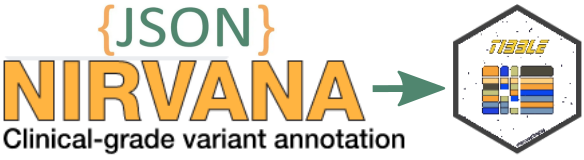

<style type="text/css">
.main-container {
  max-width: 1500px !important;
  margin-left: auto;
  margin-right: auto;
}
</style>


```{r setup, include=FALSE, echo=FALSE}
knitr::opts_chunk$set(echo=TRUE, error=FALSE)
```

{style="display: block; margin: 0 auto" }

# How to run Nirvana ([Tutorial](https://support.illumina.com/content/dam/illumina-support/help/Illumina_DRAGEN_Bio_IT_Platform_v3_7_1000000141465/Content/SW/Informatics/Dragen/Nirvana_DownloadData_fDG.htm))

## Download the files for genome Assembly

```{bash  eval=FALSE}
cd /staging/examples/outputs
mkdir Data
# Download the files for a genome assembly.
/opt/edico/share/nirvana/Downloader --ga GRCh38 --out ~/Data
```
You can use the same command to resynchronize the data sources with the Nirvana servers, including the following actions:

* Remove obsolete files, such as old versions of data sources, from the output directory. 

* Download newer files.

The following is the created output:

```{Bash eval=FALSE}

Downloader (c) 2020 Illumina, Inc.

Stromberg, Roy, Lajugie, Jiang, Li, and Kang 3.9.1-0-gc823805

---------------------------------------------------------------------------

- downloading manifest... 37 files.

- downloading file metadata:

- finished (00:00:00.8).

- downloading files (22.123 GB):

- downloading 1000_Genomes_Project_Phase_3_v3_plus_refMinor.rma.idx (GRCh38)

- downloading MITOMAP_20200224.nsa.idx (GRCh38)

- downloading ClinVar_20200302.nsa.idx (GRCh38)

- downloading REVEL_20160603.nsa.idx (GRCh38)

- downloading phyloP_hg38.npd.idx (GRCh38)

- downloading ClinGen_Dosage_Sensitivity_Map_20200131.nsi (GRCh38)

- downloading MITOMAP_SV_20200224.nsi (GRCh38)

- downloading dbSNP_151_globalMinor.nsa.idx (GRCh38)

- downloading ClinGen_Dosage_Sensitivity_Map_20190507.nga (GRCh38)

- downloading PrimateAI_0.2.nsa.idx (GRCh38)

- downloading ClinGen_disease_validity_curations_20191202.nga (GRCh38)

- downloading 1000_Genomes_Project_Phase_3_v3_plus.nsa.idx (GRCh38)

- downloading SpliceAi_1.3.nsa.idx (GRCh38)

- downloading dbSNP_153.nsa.idx (GRCh38)

- downloading TOPMed_freeze_5.nsa.idx (GRCh38)

- downloading MITOMAP_20200224.nsa (GRCh38)

- downloading gnomAD_2.1.nsa.idx (GRCh38)

- downloading ClinGen_20160414.nsi (GRCh38)

- downloading gnomAD_gene_scores_2.1.nga (GRCh38)

- downloading 1000_Genomes_Project_(SV)_Phase_3_v5a.nsi (GRCh38)

- downloading MultiZ100Way_20171006.pcs (GRCh38)

- downloading 1000_Genomes_Project_Phase_3_v3_plus_refMinor.rma (GRCh38)

- downloading ClinVar_20200302.nsa (GRCh38)

- downloading OMIM_20200409.nga (GRCh38)

- downloading Both.transcripts.ndb (GRCh38)

- downloading REVEL_20160603.nsa (GRCh38)

- downloading PrimateAI_0.2.nsa (GRCh38)

- downloading dbSNP_151_globalMinor.nsa (GRCh38)

- downloading Both.sift.ndb (GRCh38)

- downloading Both.polyphen.ndb (GRCh38)

- downloading Homo_sapiens.GRCh38.Nirvana.dat

- downloading 1000_Genomes_Project_Phase_3_v3_plus.nsa (GRCh38)

- downloading phyloP_hg38.npd (GRCh38)

- downloading SpliceAi_1.3.nsa (GRCh38)

- downloading TOPMed_freeze_5.nsa (GRCh38)

- downloading dbSNP_153.nsa (GRCh38)

- downloading gnomAD_2.1.nsa (GRCh38)

- finished (00:04:10.1).

Description Status

---------------------------------------------------------------------------

1000_Genomes_Project_(SV)_Phase_3_v5a.nsi (GRCh38) OK

1000_Genomes_Project_Phase_3_v3_plus.nsa (GRCh38) OK

1000_Genomes_Project_Phase_3_v3_plus.nsa.idx (GRCh38) OK

1000_Genomes_Project_Phase_3_v3_plus_refMinor.rma (GRCh38) OK

1000_Genomes_Project_Phase_3_v3_plus_refMinor.rma.idx (... OK

Both.polyphen.ndb (GRCh38) OK

Both.sift.ndb (GRCh38) OK

Both.transcripts.ndb (GRCh38) OK

ClinGen_20160414.nsi (GRCh38) OK

ClinGen_Dosage_Sensitivity_Map_20190507.nga (GRCh38) OK

ClinGen_Dosage_Sensitivity_Map_20200131.nsi (GRCh38) OK

ClinGen_disease_validity_curations_20191202.nga (GRCh38) OK

ClinVar_20200302.nsa (GRCh38) OK

ClinVar_20200302.nsa.idx (GRCh38) OK

Homo_sapiens.GRCh38.Nirvana.dat OK

MITOMAP_20200224.nsa (GRCh38) OK

MITOMAP_20200224.nsa.idx (GRCh38) OK

MITOMAP_SV_20200224.nsi (GRCh38) OK

MultiZ100Way_20171006.pcs (GRCh38) OK

OMIM_20200409.nga (GRCh38) OK

PrimateAI_0.2.nsa (GRCh38) OK

PrimateAI_0.2.nsa.idx (GRCh38) OK

REVEL_20160603.nsa (GRCh38) OK

REVEL_20160603.nsa.idx (GRCh38) OK

SpliceAi_1.3.nsa (GRCh38) OK

SpliceAi_1.3.nsa.idx (GRCh38) OK

TOPMed_freeze_5.nsa (GRCh38) OK

TOPMed_freeze_5.nsa.idx (GRCh38) OK

dbSNP_151_globalMinor.nsa (GRCh38) OK

dbSNP_151_globalMinor.nsa.idx (GRCh38) OK

dbSNP_153.nsa (GRCh38) OK

dbSNP_153.nsa.idx (GRCh38) OK

gnomAD_2.1.nsa (GRCh38) OK

gnomAD_2.1.nsa.idx (GRCh38) OK

gnomAD_gene_scores_2.1.nga (GRCh38) OK

phyloP_hg38.npd (GRCh38) OK

phyloP_hg38.npd.idx (GRCh38) OK

---------------------------------------------------------------------------

Peak memory usage: 52.3 MB

Time: 00:04:12.2
```


## Annotae Files and generate `Json` output

We can use `HiSeq.10000.json.gz` file, generated in previous section, or download it from github.

```{Bash eval=FALSE}

# download and example of vcf.gz file
curl -O https://raw.githubusercontent.com/HelixGrind/DotNetMisc/master/TestFiles/HiSeq.10000.vcf.gz 

#generate json output
/opt/edico/share/nirvana/Nirvana -c ~/Data/Cache/GRCh38/Both \
-r ~/Data/References/Homo_sapiens.GRCh38.Nirvana.dat \
--sd ~/Data/SupplementaryAnnotation/GRCh38 \
-i HiSeq.10000.vcf.gz -o HiSeq.10000
```

{style="display: block; margin: 0 auto" }


# JSON Structure

{style="display: block; margin: 0 auto" }

#  R Environment

[Link](https://github.com/Illumina/NirvanaDocumentation/blob/master/static/files/parse-nirvana-json-r.ipynb) to Illumina parsing style.

```{Bash, eval=FALSE}
# Load  an example of Nirvana json file output
wget https://illumina.github.io/NirvanaDocumentation/files/HiSeq.10000.json.gz
```

## Extact Header, Positions and Genes Objects from `json.gz` file

* The first line in the `JSON` file in the `header` line:

{style="display: block; margin: 0 auto" }

```{r ,  message=FALSE}
require(jsonlite)
require(DT)
require(tidyr)
require(dplyr)

file = gzfile('HiSeq.10000.json.gz', 'rt')
#file = gzfile('ceph_trio_test.json.gz', 'rt')

header = ''
positions = c()
genes = c()
is_header_line = TRUE
is_position_line = FALSE
is_gene_line = FALSE
gene_section_line = '],"genes":['
end_line = ']}'
position_count = 0
gene_count = 0
while ( TRUE ) {
    line = readLines(file, n = 1)
    trim_line = trimws(line)
    if ( is_header_line ) {
        ## only keep the "header" field content from the line
        header = substr(trim_line, 11, nchar(trim_line)-14)
        is_header_line = FALSE
        is_position_line = TRUE
        next
    }
    if ( trim_line == gene_section_line ) {
        is_gene_line = TRUE
        is_position_line = FALSE
        next
    }
    else if ( trim_line == end_line ) {
        break
    }
    else {
        if ( is_position_line ) {
            ## remove the trailing ',' if there is
            positions = c(positions, sub(",$", "", trim_line))
            position_count = position_count + 1
        }
        if ( is_gene_line ) {
            ## remove the trailing ',' if there is
            genes = c(genes, sub(",$", "", trim_line))
            gene_count = gene_count + 1
        }
    }
}
close(file)

paste0('Header Object_',1:5,": ", fromJSON(header)[1:5])
```

```{r}
#gsub('"', '', header, fixed=TRUE)
DT::datatable(fromJSON(header)[6][[1]], 
              options = list(scrollX = TRUE,
                             columnDefs = list(list(className = 'dt-center', targets = all))
                             ), 
              rownames = FALSE, caption = 'Header Object_6')
```

```{r}
print(paste('number of positions: ', position_count))
print(paste('number of genes: ', gene_count))
```

## Convert Positions object to a Tibble

* Followed by the `positions` lines (two positions lines in this case:)

{style="display: block; margin: 0 auto" }


{width=30%}{width=30%}{width=30%}


```{r}

#fromJSON(positions[7]) %>% as.data.frame()  %>% DT::datatable(options = list(scrollX = TRUE), rownames = TRUE) 

#bind_rows(fromJSON(positions[7])) %>% 
#  tidyr::unnest(cols = c(samples, variants), names_sep = ".") %>% 
#  DT::datatable(options = list(scrollX = TRUE), rownames = TRUE) 

#fromJSON(positions[1:7])

positions[1:10] |>
  lapply(function(x) dplyr::bind_rows(fromJSON(x)) |>   
           tidyr::unnest(cols = c(samples, variants), names_sep = ".")  ) |>
  dplyr::bind_rows(.id = "index") |>
  #tidyr::unnest(c( samples.variantFrequencies, samples.alleleDepths))%>% 
  #tidyr::unnest(filters) %>%
  #distinct() %>%
  DT::datatable(options = list(scrollX = TRUE#,
                 #columnDefs = list(list(className = 'dt-center', targets = c(0, 25)))
                ),
                rownames = FALSE
                )
```
* But it seems we lost data.frame hidden in some cells.

* We look for `gnomad` pattern in positions 

```{r}
# Look for gnomAD infos

# get index of item that have gnomad pattern
grep("gnomad", positions, value = FALSE)
```
`gnomad` info start from index 163.

* Display `gnomad` info

```{r}
grep("gnomad", positions[163], value = TRUE)
```


* Display the structure of samples and variants columns.

```{r}
bind_rows(fromJSON(positions[163])) |>
  select(samples, variants) %>% str()
```

 * Try to unnest variants column
 
```{r}
 bind_rows(fromJSON(positions[163]))$variants |>
  unnest(cols = c(dbsnp, gnomad, topmed, transcripts), names_sep = ".") |>
  DT::datatable(options = list(scrollX = TRUE))
```

* It seems that Variants as more columns with nested multiple dataframe. 

* The variant column is not the same and can differ in columns and datafarme dimension.

* Look for colnames with a list of data.frames and try to unnest them

```{r}

positions[c(1:10,163,163 , 237,  288, 397,  572) ] %>%
  lapply(function(x) dplyr::bind_rows(fromJSON(x)) %>%  
           unnest(cols = c(variants, samples), names_sep = ".") %>% 
           {
             if(c("variants.gnomad") %in% names(.))  unnest(., cols = c(variants.dbsnp, variants.gnomad,  variants.transcripts), names_sep="_") else .
           }  %>%
           {
             if(c("variants.topmed") %in% names(.))  unnest(., cols = c(variants.topmed), names_sep="_") else .
           }  %>%
           {
             if(c("variants.globalAllele") %in% names(.))  unnest(., cols = c(variants.globalAllele, variants.oneKg), names_sep="_") else .
           }  %>%
           { if(c("samples.variantFrequencies") %in% names(.)) unnest(., cols = c(samples.variantFrequencies, samples.alleleDepths), names_sep = "_")
             else .
           } %>%
           {
             if(c("variants.regulatoryRegions") %in% names(.)) unnest(., cols=c( variants.regulatoryRegions), names_sep = "_") else .
           } %>%
           {
             if(c("variants.regulatoryRegions_consequence") %in% names(.)) unnest_longer(.,c( variants.regulatoryRegions_consequence)) else .
           } %>%
           {
             if(c("variants.transcripts") %in% names(.)) unnest(.,cols= c( variants.transcripts), names_sep= "_") else .
           } %>%
           {
             if(c("variants.transcripts_consequence") %in% names(.)) unnest(., cols = c(variants.transcripts_consequence), names_sep="_") else .
           } )|>
  dplyr::bind_rows(.id = "index") |>
  #tidyr::separate(variants.transcripts_hgnc, into = c("Accession","variants.transcripts_hgnc"), sep = ".") |>
  #mutate( Accession = stringr::str_split(variants.transcripts_hgnc, pattern = ".", simplify = TRUE)) |>
  mutate(`__Accession__` = case_when(stringr::str_detect(variants.transcripts_hgnc, "\\.") ~
                                                stringr::str_extract(variants.transcripts_hgnc, ".*(?=\\.\\d$)"), 
                                     TRUE ~ variants.transcripts_hgnc)) |>
  select(index, `__Accession__`, variants.transcripts_hgnc,variants.transcripts_geneId,  everything()) |>
  DT::datatable(options = list(scrollX = TRUE,
                               columnDefs = list(list(className = 'dt-center', targets = "_all"))
  ),
  rownames = FALSE
  )

   
```

## Convert Genes Object to Tibble

* After the `positions` lines, there are the `genes` lines, which are optional if there is no overlapping gene of the input `VCF` variants (3 lines for 2 genes in th example)

{style="display: block; margin: 0 auto" }


```{r}

genes[c(1:77)] |>
  lapply(function(x) as.data.frame(fromJSON(x)) %>% 
           {
             if(c("omim.phenotypes") %in% names(.)) tidyr::unnest(., cols=c( omim.phenotypes), names_sep = "_") else .
           }
  )  %>% 
  bind_rows() %>%
  rename("_________________________omim.description____________________________"= omim.description,
         "____________________omim.phenotypes_description______________________"= omim.phenotypes_description) %>%
    mutate(`__Accession__` = case_when(stringr::str_detect(name, "\\.") ~
                                                stringr::str_extract(name, ".*(?=\\.\\d$)"), 
                                     TRUE ~ name)) %>%
  
  select(`__Accession__`, name, omim.geneName, clingenGeneValidity.classification, everything()) %>%
  DT::datatable(options = list(scrollX = TRUE, autoWidth = TRUE,
                               columnDefs = list(list(className = 'dt-center', targets = "_all"), 
                                                 list(width = '650px', targets= list(11,  14)),
                                                 list(width = '200px', targets= list(9,  10)))
  ),
  rownames = FALSE
  ) #%>% 
  #DT::formatStyle(columns = c(11, 14), width='650px')


```

## Look for intersection between `Positions` and `Genes` Objects

* The column `variants.transcripts_hgnc` in `Positions` object has commun parttern with `name` column in `genes` object. 

* We mutate a new column named `__Accession__` to extract only commun pattern

# Python environment

This is specific to Rstudio computing environments (IDE).

```{bash eval = FALSE}
which python3
```

```{r}
# Set python environment and version in RStudio ;-)
reticulate::use_python("/usr/bin/python3", required = TRUE)
reticulate::py_config()
```


```{python}
import gzip

header = ''
positions = []
genes = []
is_header_line = True
is_position_line = False
is_gene_line = False
gene_section_line = '],"genes":['
end_line = ']}'
with gzip.open('HiSeq.10000.json.gz', 'rt') as f:
    position_count = 0
    gene_count = 0
    for line in f:
        trim_line = line.strip()
        if is_header_line:
            ## only keep the "header" field content from the line
            header = trim_line[10:-14]
            is_header_line = False
            is_position_line = True
            continue
        if trim_line == gene_section_line:
            is_gene_line = True
            is_position_line = False
            continue
        elif trim_line == end_line:
            break
        else:
            if is_position_line:
                ## remove the trailing ',' if there is
                positions.append(trim_line.rstrip(','))
                position_count += 1
            if is_gene_line:
                ## remove the trailing ',' if there is
                genes.append(trim_line.rstrip(','))
                gene_count += 1

#print ('header object:', header)
print ('number of positions:', position_count)
print ('number of genes:', gene_count)
```


```{r}
print("The first five objects of the header")
jsonlite::fromJSON(reticulate::py$header)[1:5]
```
```{r}

DT::datatable(jsonlite::fromJSON(reticulate::py$header)[6][[1]], caption = 'The sixth object of the header')
```

### Retrieve variants under a gnomAD allele frequency threshold


```{python}

import pandas as pd
import json

variants_field = 'variants'
gnomad_field = 'gnomad'
freq_threshold = 0.0001
freq_data = {'variant_id': [], 'gnomAD_allele_freq': []}
for position in positions:
    position_dict = json.loads(position)
    if variants_field in position_dict:
        for variant_dict in position_dict[variants_field]:
            if gnomad_field in variant_dict:
                freq = variant_dict[gnomad_field]['allAf']
                if freq < freq_threshold:
                    freq_data['variant_id'].append(variant_dict['vid'])
                    freq_data['gnomAD_allele_freq'].append(freq)

freq_df = pd.DataFrame(data=freq_data)
```

```{r}
DT::datatable(reticulate::py$freq_df)
```


### Retrieve all relevant genes and their OMIM gene names


```{python}


gene_data = {'gene': [], 'OMIM_gene_name': [], 'Description': []}
for gene in genes:
    gene_dict = json.loads(gene)
    gene_data['gene'].append(gene_dict['name'])
    omim_gene_name = ''
    description = ''
    if 'omim' in gene_dict:
        omim_dict = gene_dict['omim'][0]
        if 'geneName' in omim_dict:
            omim_gene_name = omim_dict['geneName']
        if 'description' in omim_dict:
            description = omim_dict['description']
    gene_data['OMIM_gene_name'].append(omim_gene_name)
    gene_data['Description'].append(description)
gene_df=pd.DataFrame(data=gene_data)
```

```{r}
library(reticulate)
DT::datatable(reticulate::py$gene_df)
```

# Visualize json file with circos (circular heatmap) layout

This is may be useful to visualize json output from NGS.

## useful packages

* [shiny.gosling](https://github.com/Appsilon/shiny.gosling)

* [radial_heatMap_generator](https://github.com/wjsutton/radial_heatmap_generator)

* [circulize](https://cran.r-project.org/web/packages/circlize/index.html)

* [CoffeeWheel](https://github.com/armish/coffeewheel)


```{r  massage=FALSE, warning=FALSE, comment=FALSE, include=FALSE}
library(data.table)
if(is.null(system.file(package='shiny.gosling'))){
remotes::install_github("Appsilon/shiny.react")
remotes::install_github("Appsilon/shiny.gosling")
}
```

* Glimpse the structre of json file used by `shiny.gosling`

```{r}
jsonlite::fromJSON(txt = "data/server.gosling-lang.org.json") |> str()

```


```{r, warning=FALSE, message=FALSE}
jsonlite::fromJSON(txt = "data/server.gosling-lang.org.json")[[1]][6] |> as.data.frame() |>
  tidyr::separate(col = row_infos, into = c("espece", "Ref1", "Ref2", "Ref3",
                                            "Ref4", "Ref5", "Ref6", "Ref7", 
                                            "Ref8", "Ref9", "Ref11"), sep = "[^[:alnum:] ]+") |>
    DT::datatable(options = list(scrollX = TRUE,
                               columnDefs = list(list(className = 'dt-center', targets = "_all"))
  ),
  rownames = FALSE)

```


```{r, warning=FALSE}

file <- jsonlite::fromJSON("data/server.gosling-lang.org.json")


file |>
  purrr::map(as.data.table) |> 
  rbindlist(fill=TRUE, idcol = TRUE) |>
  tidyr::separate(col = row_infos, into = c("info1", "info2", "info3", "info4",
                                            "info5", "info6", "innfo7", "info8", 
                                            "info9", "info10", "info11"), sep = "[^[:alnum:] ]+") |>
  DT::datatable(options = list(scrollX = TRUE,
                               columnDefs = list(list(className = 'dt-center', targets = "_all"))
  ),
  rownames = FALSE)


```


```{r}
structureVariant <- readr::read_csv("data/structureVariant.csv", show_col_types = FALSE)

structureVariant |>
    DT::datatable(options = list(scrollX = TRUE,
                               columnDefs = list(list(className = 'dt-center', targets = "_all"))
  ),
  rownames = FALSE)
```


```{r, echo=FALSE, runtime: shiny}
#shiny.gosling::run_example("multiTrackApp")
```


