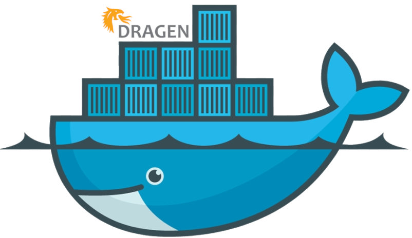
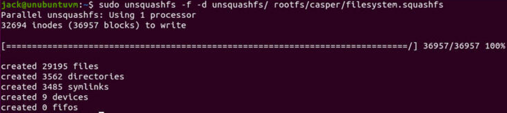

<!-- README.md is generated from README.Rmd. Please edit that file! -->

```{r knitr_config, echo = FALSE}
knitr::opts_chunk$set(
  collapse = TRUE,
  comment = "#>",
  fig.path = "README.md"
)
```

# Dockerize Dragen 

This Quick Start deploys Dynamic Read Analysis for GENomics Suite (DRAGEN CS), a data analysis platform by Illumina, on CentOS/ORACLE Linux/Clonezilla OSs.

## How to extract Installer file from `.Run` file

The installer file like `dragen-4.0.3-8.el8.x86_64.run` is composed by [3 files](https://github.com/kmezhoud/Dragen/tree/main/extract_installer.md):

* `edico_driver-1.4.7-4.0.3.el8.x86_64.rpm`, 
* `edico-4.0.3-15.el8.x86_64.rpm`, and
* `installer`.

## Create Docker image from .ISO file

The goal is to use/convert ORACLE/CentOS/Cloneziolla .ISO image as a docker container.

```{bash eval=FALSE}
sudo apt-get install squashfs-tools -y
wget -P ~/Download/ https://webdata.illumina.com/downloads/software/clonezilla/clonezilla-live-40.0.C11.20221017.RAID_OL8_CF.iso
mkdir rootfs unsqushfs
# To mount the ISO image into the rootfs folder 
sudo mount -o loop ~/Download/clonezilla-live-40.0.C11.20221017.RAID_OL8_CF.iso ~/rootfs
# We need to locate the directory housing of the filesystem.squashfs file. 
cd ~/rootfs
# locate the file
find . -type f | grep filesystem.squashfs
#The file is locate at ./live/filesystem.squashfs
cd ..
## we can extract the necessary filesystem files from the rootfs directory into the unsquashfs directory 
sudo unsquashfs -f -d unsquashfs/ rootfs/live/filesystem.squashfs
```



```{bash eval=FALSE}
# Finally, we can compress and import the image using Docker
sudo tar -C unsquashfs -c . | docker import - ol8_illumina:latest

# list docker image
docker image ls
```

```{eval = FALSE}
ol8_illumina           latest    fe075c356df2   3 minutes ago   1.14GB
```