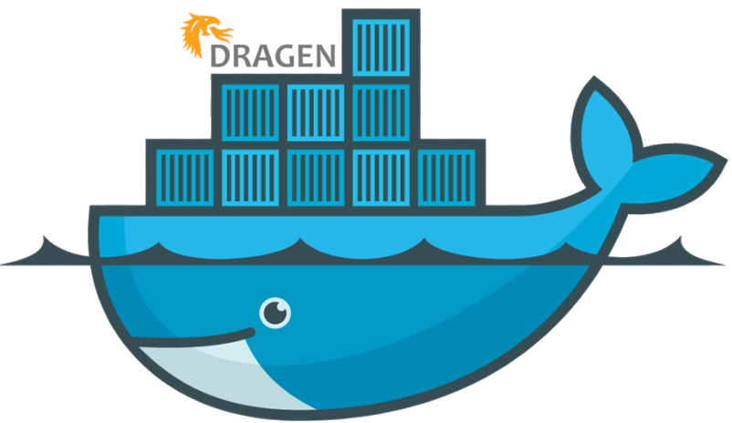
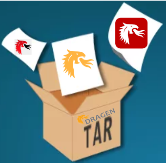
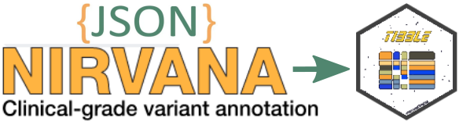
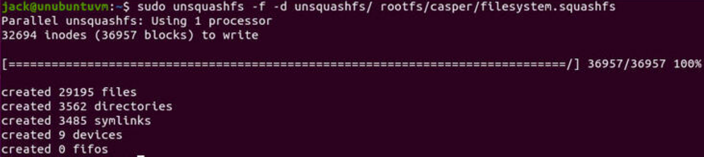

Playing around Dragen Server
================
Karim Mezhoud
2023-02-14

<!-- README.md is generated from README.Rmd. Please edit that file! -->

# Dockerize Dragen 

This Quick Start deploys Dynamic Read Analysis for GENomics Suite
(DRAGEN CS), a data analysis platform by Illumina, on CentOS/ORACLE
Linux/Clonezilla OSs.

## How to extract `dragen-x.x.x.el8.x86_64.run` file

<a href="https://kmezhoud.github.io/Dragen//extract_installer/extract_installer.html" target = "_blank">

</a>

The installer file like `dragen-4.0.3-8.el8.x86_64.run` is composed by
[3
files](https://kmezhoud.github.io/Dragen/extract_installer/extract_installer.html):

- `edico_driver-1.4.7-4.0.3.el8.x86_64.rpm`,
- `edico-4.0.3-15.el8.x86_64.rpm`, and
- `installer`.

## Parsing Nirvana `Json` file to `tibble`

<a href="https://kmezhoud.github.io/Dragen/Nirvana/Nirvana.html" target = "_blank">

</a>

 

 

 

## Create Docker image from .ISO file

The goal is to use/convert ORACLE/CentOS/Cloneziolla .ISO image as a
docker container.

``` bash
sudo apt-get install squashfs-tools -y
wget -P ~/Download/ https://webdata.illumina.com/downloads/software/clonezilla/clonezilla-live-40.0.C11.20221017.RAID_OL8_CF.iso
mkdir rootfs unsqushfs
# To mount the ISO image into the rootfs folder 
sudo mount -o loop ~/Download/clonezilla-live-40.0.C11.20221017.RAID_OL8_CF.iso ~/rootfs
# We need to locate the directory housing of the filesystem.squashfs file. 
cd ~/rootfs
# locate the file
find . -type f | grep filesystem.squashfs
#The file is locate at ./live/filesystem.squashfs
cd ..
## we can extract the necessary filesystem files from the rootfs directory into the unsquashfs directory 
sudo unsquashfs -f -d unsquashfs/ rootfs/live/filesystem.squashfs
```



``` bash
# Finally, we can compress and import the image using Docker
sudo tar -C unsquashfs -c . | docker import - ol8_illumina:latest

# list docker image
docker image ls
```

``` eval
ol8_illumina           latest    fe075c356df2   3 minutes ago   1.14GB
```

## Customize `ol8_illumina` image with Dragen installer, ssh access and others needed tools

go to same folder where the
[Dockerfile](https://github.com/kmezhoud/Dragen/tree/main/Dockerfile)
and run the two commands. There ar two option to run the container:
interactively or detached. In the same folder we need
`dragen-4.0.3-8.el8.x86_64.run` installer that you can get from illumina
download
[page](https://support.illumina.com/sequencing/sequencing_software/dragen-bio-it-platform.html).

``` bash
docker build -t ol8_ill_drag_el8:latest .
# run it interactively (-i)
#you will prompted directly  to container terminal
# root@ol8_illu_drag_el8:/home_dragen
docker run -h ol8_illu_drag_el8 -i -t ol8_illu_drag_el8:latest bash

#or detach the container from the terminal -d
docker run -dit --name dragen ol8_illu_drag_el8:latest

# list running container 
docker container ls
```

    CONTAINER ID   IMAGE                      COMMAND                  CREATED          STATUS          PORTS     NAMES
    d7553c21ea9a   ol8_illu_drag_el8:latest   "/bin/sh -c 'service…"   29 seconds ago   Up 28 seconds             dragen

To execute command from running container

``` bash
docker exec -it dragen ls
```

To attach the running container

    docker attach dragen
